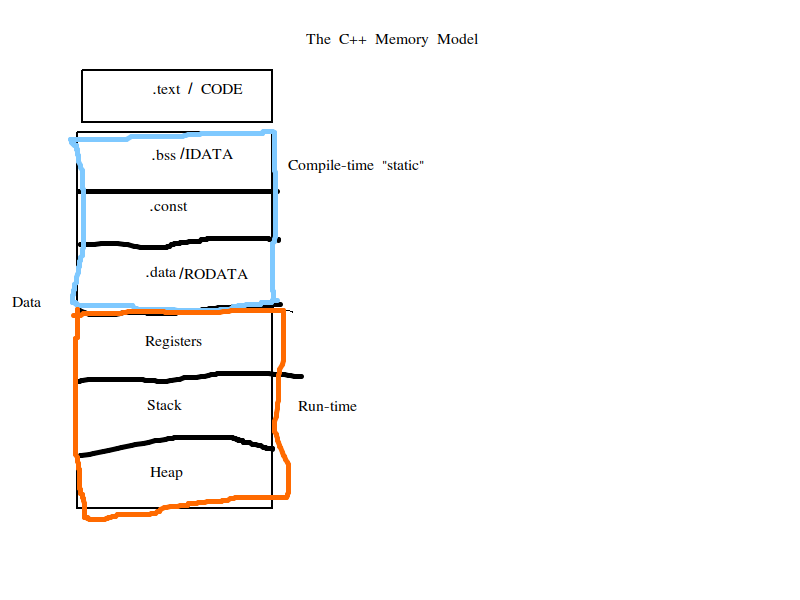

# First day C++ Course

# Table of Contents
1. [Compilation](#compilation)
2. [Object model](#object-model)


## The compilation process <div id="compilation"></div>

Build systems: Command line, [Makefile](https://www.gnu.org/software/make/manual/html_node/Introduction.html), [CMake](https://cmake.org/), [Scons](https://scons.org/)
 
1. Preprocessor
2. Whitespace removal
3. Tokenising (largest possible token strategy from left to right)
4. Syntax analysis => Possible errors if not correct at this point
5. Intermediate Representation
6. Semantic analysis => Warnings
   * Platform dependent implementation (size of integers, floating points, etc)
   * Utilising variables that are not initialised
7. Optimisation
8. Final output (object code/files)


### Object file structure 

1. Data definitions
2. Program opcodes
3. Symbol table (things that are given addresses - function calls, the addresses for them, so they can be called)
4. Debug info
5. Exports
6. etc...

#### Linker's job

Combine all object files together.


##### Linker Symbol resolution

The ODR-USED (One Definition Rule).

   * An object must have a single address for its entire life.
   * Undefined symbol


##### Linker selection location

RAM: Program data
Flash: Application code, library code, start-up and run-time code


##### Take away message

Do not rely on undefined behaviour


##### Static analysis tools

   * PC Lint
   * others


## The C++ object model <div id="object-model"></div>





### Object definition


Type specifies:

   * How much memory
   * Memory interpretation
   * Allowable behaviours


"Using an object is reading an object" (wat?)


c++11 introduced a uniform initialisation syntax. It's called the brace initialisation. Example:


```c++
int main(){
    int i { 10 };       // Initialise => 10
    int j { 17.6 };     // Error - Narrowing from double to int
    int k { };          // Default initialise => 100
    const int l { 100 }; //Initialise => 100
}
```


A for loop in c++11


```c++

...

for(int i { 0 }; i < 10; ++i){
    ....
}


```


## Expressions


An expression is a chain of computations that yields a final result.

Example 2

```c++
int main(){

   char a { 5 };
   short b { 2 };

   a+b; // yields an int, (it is called type promotion. An int is the size of register)

}
```

Example 2


```c++
int main(){

   char a { 5 };
   float b { 2.0 };

   a+b; // yields a float, type promotion again, if we didn't convert o float we would lose information

}
```


Example 3

```c++
int main(){

   char a { 5 };
   float b { 2.0 };
   double c { 3.0 }

   a+b; // yields a double, (it is called type promotion. An int is the size of register)

}
```


Example 4

```c++
int main(){

   signed int a { -5 };
   unsigned int { 3 };

   a+b; // yields a unsigned int, unsigned int is a wider type.

}
```
