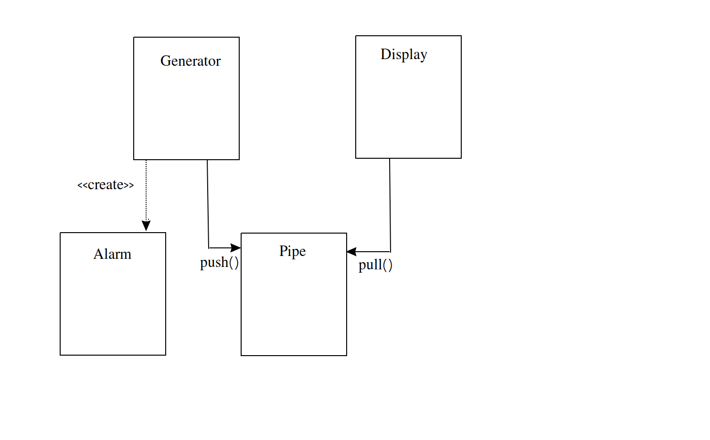

## Day 02


### Interesting links

  * Check assembly code of generated by Cpp compiler: https://godbolt.org/
  * [Jason Turner](https://www.youtube.com/channel/UCxHAlbZQNFU2LgEtiqd2Maw)


### Extending compiler diagnostics

Language extensions to extend compiler diagnostics. Examples:


```cpp


void func(const ADT& adt [[ maybe_unused ]]){

    // Compiler won't complain if adt is unused

}


[[ noreturn ]] void control_loop();

[[ nodiscard ]] Error_type might_fail();

[[ deprecated("Use new_do_stuff instead") ]]
void do_stuff();
```

### Function parameter summary


IN: 

```cpp
//Scalar
void f(const T)
void f(T);

//User-defined
void f(const T&)

//Call
f(x)
```

IN-OUT:

```cpp

//Scalar and User-defined
void f(T&);
void f(T * const);

//Call
f(x);
f(&x);
```

OUT:

```cpp

//Scalar and User-defined
T f();
std::optional<T> f();
std::tuple<T,G> f();
```

### Constants

* Compile time immutability vs. run-time immutability


```cpp

#define SIZE 16

int main(){

  int size { 10 };
  const int sz { 16 };

  constexpr int array[sz];
}
```


### Exercise 03


